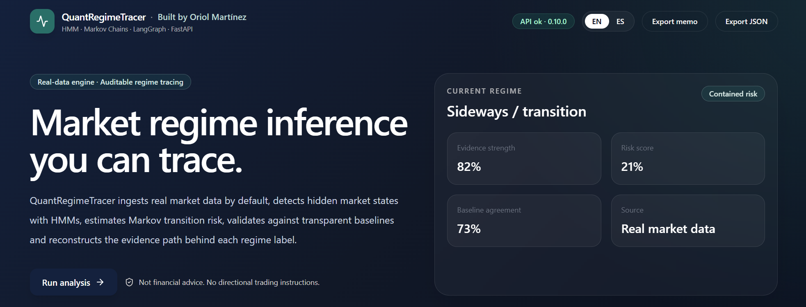
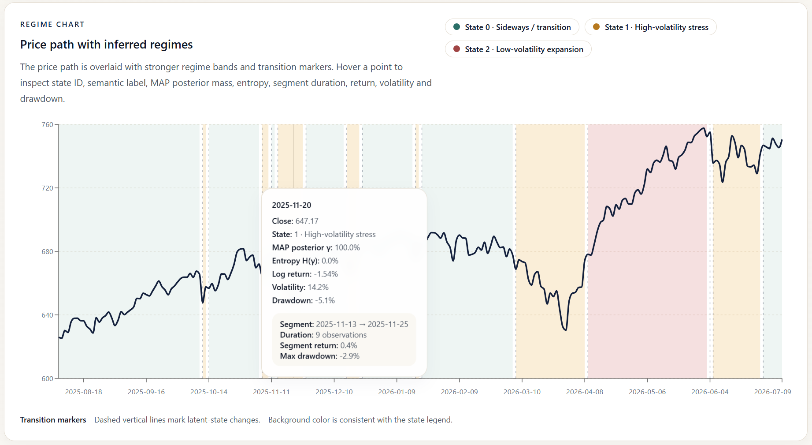
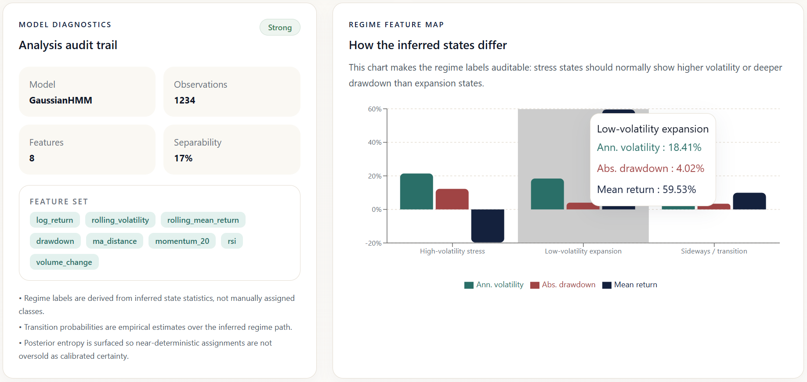
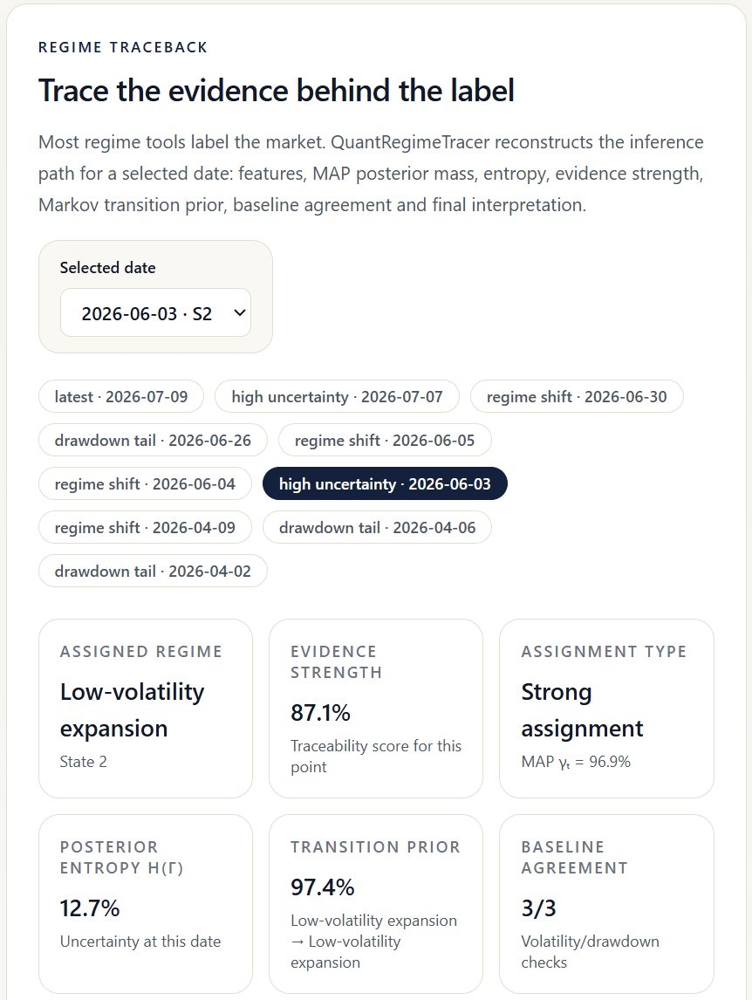
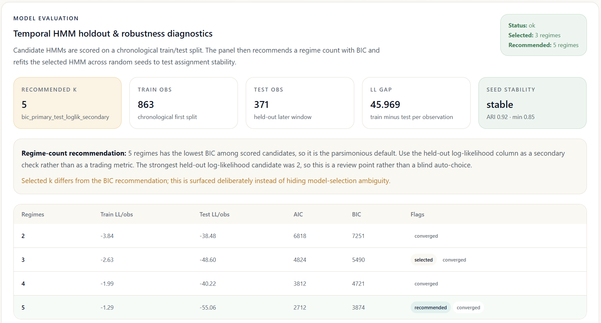
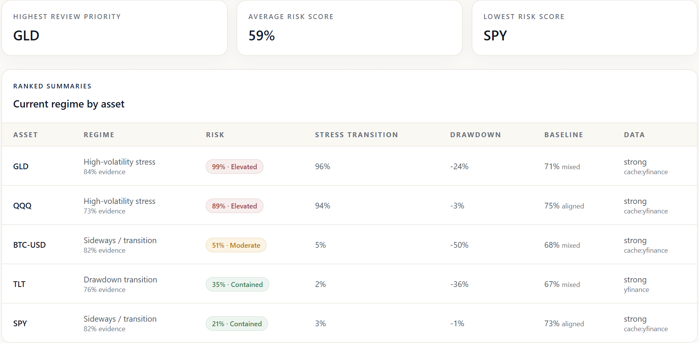
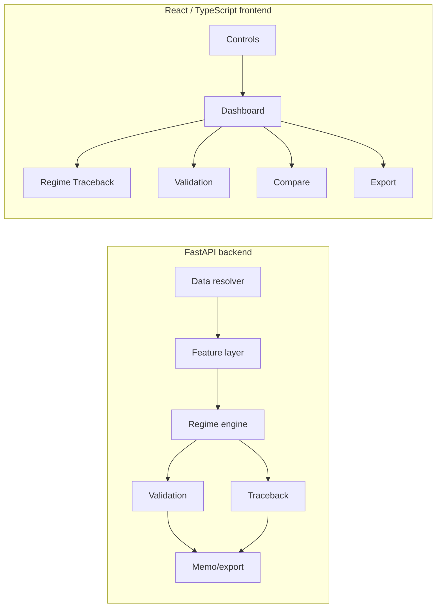
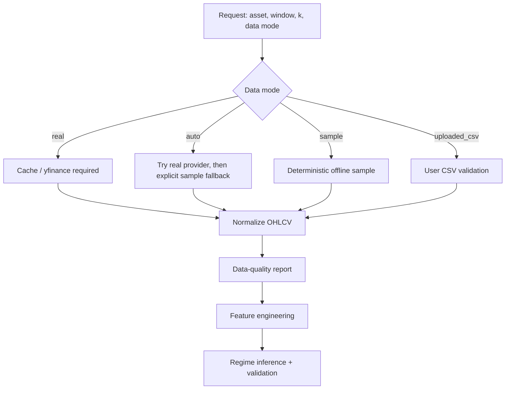

<div align="center">

# QuantRegimeTracer

### Full-stack AI/quant workbench for auditable market-regime inference

Trace latent market regimes from real financial time series, expose the evidence path behind each regime label, and validate whether the inferred state path is stable, interpretable, and supported by real-data diagnostics.

<br/>


**FastAPI · React/TypeScript · Gaussian HMM · Markov chains · yfinance · validation diagnostics · Regime Traceback · guarded memo export**

<br/>



</div>

> **Core idea.** Most regime tools label the market. **QuantRegimeTracer traces the evidence behind the label.**

QuantRegimeTracer is a full-stack research workbench for **auditable market-regime inference**. It ingests real market data by default, engineers time-series risk features, infers latent regimes with a Gaussian Hidden Markov Model, estimates empirical Markov transition risk, benchmarks the inferred stress regime against transparent baselines, and exposes a point-level **Regime Traceback** layer that reconstructs the evidence path behind each regime label.

The system is deliberately framed as **model diagnostics and risk review**, not as a trading bot, portfolio optimizer, or financial-advice engine.

---

## Table of contents

- [Why this project exists](#why-this-project-exists)
- [Screenshots](#screenshots)
- [System structure](#system-structure)
- [Data ingestion pipeline](#data-ingestion-pipeline)
- [Feature engineering](#feature-engineering)
- [Regime inference](#regime-inference)
- [Regime Traceback](#regime-traceback)
- [Validation layer](#validation-layer)
- [Real-data validation findings](#real-data-validation-findings)
- [API surface](#api-surface)
- [Running locally](#running-locally)
- [Tests and gates](#tests-and-gates)
- [Repository structure](#repository-structure)
- [Known limitations](#known-limitations)
- [Roadmap](#roadmap)

---

## Why this project exists

Market time series are noisy and non-stationary. A raw price chart rarely answers the operational questions that matter during review:

- Which regime does the latest observation resemble?
- How persistent has this regime been historically?
- How likely is a transition into a stress-like state under the fitted transition matrix?
- Is the model output consistent with simpler volatility and drawdown baselines?
- Is the chosen number of regimes supported by BIC / held-out likelihood diagnostics?
- Are HMM assignments stable across random initializations?
- Was the analysis run on real market data, cached provider data, uploaded CSV data, or offline sample data?
- For any selected date, which features, posterior probabilities, transition priors and baselines explain the assigned regime?

QuantRegimeTracer answers those questions through an end-to-end backend + frontend system rather than a notebook.

---

## Screenshots

### 1. Real-data analysis setup


The analysis setup exposes the asset, window, custom start date, regime count, data mode, force-refresh policy and export actions. This makes the data policy visible before the model output is interpreted.

### 2. Price path with inferred regimes



The dashboard overlays inferred latent regimes on the real SPY price path. Regime bands and transition markers make the state path readable while preserving the underlying time-series context.

### 3. Model diagnostics and feature map

<p align="center">
  
</p>

The diagnostic layer shows the feature set used by the regime engine and compares inferred states by volatility, drawdown and return profile. This makes semantic regime labels auditable instead of treating them as manually assigned classes.

### 4. Regime Traceback: evidence behind the label

<p align="center">
  
</p>

Regime Traceback reconstructs the evidence path behind a selected date: assigned state, evidence strength, assignment type, posterior entropy, Markov transition prior, baseline agreement and feature-level evidence.

### 5. Validation diagnostics: GLD overfit-risk case



The validation panel surfaces model-selection ambiguity and temporal holdout risk. In the GLD run, the selected 3-regime model differs from the BIC-recommended 5-regime candidate and the log-likelihood gap is explicitly shown as a review point.

### 6. Cross-asset regime review



The comparison layer ranks multiple real-market assets by current regime, risk score, stress-transition probability, drawdown pressure, baseline agreement and data quality.

---

## System structure

QuantRegimeTracer is organized as a full-stack research workbench. The backend owns data resolution, model fitting, validation and report generation. The frontend owns controls, analytical views, traceability panels and exports.



### Main surfaces

| Surface | Purpose |
|---|---|
| Dashboard | Current regime, evidence strength, regime chart, posterior state mass and summary metrics |
| Regime Traceback | Date-level reconstruction of the evidence path behind a regime label |
| Validation | BIC/AIC, held-out likelihood, seed stability, baselines and data quality |
| Compare | Cross-asset ranking by current regime, risk, drawdown, baseline agreement and data quality |
| Export | Markdown / JSON outputs with guardrails and source metadata |

---

## Data ingestion pipeline

The project is **real-market-data first**. It uses cached provider data when available, yfinance when online, uploaded CSV when supplied, and deterministic sample data only when explicitly requested.



### Data modes

| Mode | Behavior | Sample fallback | Intended use |
|---|---|---:|---|
| `real` | Requires local cache or yfinance market data | No | Normal operation and real validation |
| `auto` | Tries cache/yfinance first, then deterministic sample | Yes, explicit warning | Offline continuity or degraded local runs |
| `sample` | Uses deterministic synthetic regime-switching data | N/A | Unit tests, reproducible development, offline examples |
| `uploaded_csv` | User-supplied `date, close, volume?` CSV | N/A | Custom datasets |

The API response includes a `source_report` object. A run should not be treated as real-market backed unless:

```text
source_report.is_real_data == true
source in {"yfinance", "cache:yfinance"}
```

---

## Feature engineering

The feature layer converts raw price/volume into state variables used by the HMM.

| Feature | Meaning |
|---|---|
| `log_return` | One-period log return |
| `rolling_volatility` | Annualized rolling return volatility |
| `rolling_mean_return` | Rolling drift proxy |
| `drawdown` | Distance from rolling peak |
| `ma_distance` | Price distance from moving average |
| `momentum_20` | 20-period return |
| `rsi` | Relative Strength Index |
| `volume_change` | Optional volume change, if volume is available |

### Core formulas

Log return:

$$
r_t = \log(P_t) - \log(P_{t-1})
$$

Rolling annualized volatility:

$$
\sigma_t = \mathrm{std}(r_{t-w:t}) \sqrt{252}
$$

Drawdown:

$$
d_t = \frac{P_t}{\max(P_{0:t})} - 1
$$

Momentum:

$$
m_t = \frac{P_t}{P_{t-20}} - 1
$$

RSI:

$$
RSI_t = 100 - \frac{100}{1 + RS_t}
$$

The model is not trained on raw prices directly; it operates on normalized risk and trend features.

---

## Regime inference

The regime engine fits a Gaussian Hidden Markov Model when `hmmlearn` is available:

$$
z_t \sim \mathrm{Categorical}(A_{z_{t-1}})
$$

$$
x_t \mid z_t = i \sim \mathcal{N}(\mu_i, \Sigma_i)
$$

Where:

- \(x_t\) is the engineered feature vector;
- \(z_t\) is the latent regime state;
- \(A\) is the transition matrix;
- \(\mu_i, \Sigma_i\) define each state emission distribution.

### How the HMM is used

The HMM treats market behavior as a sequence of **unobserved latent states**. The model does not receive labels such as `bull`, `stress`, or `sideways`. Instead, it observes engineered features such as volatility, drawdown, momentum and RSI, then estimates which hidden state most likely generated each observation.

At each timestamp, the model combines two sources of information:

1. **Emission likelihood** — how compatible the current feature vector is with each state's Gaussian distribution.
2. **Transition structure** — how likely the model is to move from the previous latent state to the next one.

The posterior state mass is computed over the full observation sequence:

$$
\gamma_t(i) = P(z_t = i \mid x_{1:T})
$$

The displayed state is the maximum-posterior assignment:

$$
\hat{z}_t = \arg\max_i \gamma_t(i)
$$

This means that a near-one-hot posterior is interpreted as **strong state assignment**, not as market forecast certainty. A high posterior state mass says that the current feature vector is strongly mapped to one latent state under the fitted model; it does not say that the future price path is known.

### Why label switching matters

HMM state IDs are arbitrary. State `0` in one fit may correspond to a different economic interpretation in another fit. QuantRegimeTracer therefore applies a post-fit semantic labeling layer: it ranks states by realized volatility, drawdown, mean return, persistence and stress-transition behavior before assigning readable labels.

This is why the UI always shows both:

```text
State ID          raw latent-state identifier
Semantic label    post-fit interpretation from state statistics
```

If the HMM cannot be fitted, the backend falls back to deterministic KMeans continuity and clearly flags the fallback in the API response. The fallback is not presented as a probabilistic HMM posterior.

### Semantic labels

HMM state IDs are arbitrary. QuantRegimeTracer therefore assigns semantic labels **after fitting** using inferred state statistics:

- annualized volatility;
- drawdown profile;
- mean return;
- persistence;
- stress-transition behavior.

Example labels:

```text
Low-volatility expansion
High-volatility stress
Sideways / transition
Drawdown transition
```

This helps avoid label-switching errors while still preserving the raw state ID.

---

## Markov transition layer

After the latent state path is inferred, the system estimates an empirical transition matrix:

$$
P_{ij} = \Pr(z_{t+1}=j \mid z_t=i)
$$

From this matrix it derives:

| Metric | Meaning |
|---|---|
| Stay probability | \(P_{ii}\) for the current regime |
| Expected persistence | \(1 / (1 - P_{ii})\) |
| Stress transition probability | Probability of moving into a stress-like state |
| Transition entropy | Uncertainty in the transition row |

Transition entropy:

$$
H(P_{i\cdot}) = -\sum_j P_{ij}\log(P_{ij})
$$

These are diagnostics, not directional trading forecasts.

---

## Regime Traceback

Regime Traceback is the project’s main differentiator.

For any selected date, the system reconstructs the path from raw market behavior to regime assignment:

```text
Selected date
→ feature evidence
→ MAP posterior state mass
→ posterior entropy
→ Markov transition prior
→ baseline votes
→ evidence strength
→ final interpretation
```

The goal is to make regime inference **auditable**. The user can inspect not only *what* regime was assigned, but *why* the assignment happened and what evidence supports or weakens it.

### State mass is not forecast confidence

The HMM can produce near-one-hot posterior state assignments:

$$
\gamma_t(i) = \Pr(z_t=i \mid x_{1:T})
$$

A high \(\gamma_t(i)\) means the observation maps strongly to one latent state under the fitted model. It does **not** mean the model is certain about future market direction.

The UI separates:

| Concept | Meaning |
|---|---|
| MAP posterior state mass | HMM assignment strength for the current observation |
| Posterior entropy | Ambiguity of the state assignment |
| Evidence strength | Composite traceability score |
| Risk score | Review-oriented risk diagnostic |
| Forecast confidence | Not claimed |

---

## Validation layer

QuantRegimeTracer validates the regime path rather than assuming the chart is trustworthy.

### 1. Model-selection diagnostics

Candidate HMMs are scored across \(k=2..5\) using AIC/BIC and chronological train/test log-likelihood.

AIC:

$$
AIC = 2p - 2\log L
$$

BIC:

$$
BIC = p \log(n) - 2\log L
$$

Where \(p\) is the number of model parameters and \(n\) is the number of observations.

### 2. Chronological holdout

The first 70% of observations are used for fitting and the later 30% for held-out likelihood diagnostics. This is not a trading backtest; it is a sequence-model sanity check.

### 3. Multi-seed stability

The selected HMM is refit across multiple random seeds. Assignment stability is measured with Adjusted Rand Index (ARI):

```text
high ARI   → similar state partitions across seeds
low ARI    → unstable regime path; interpret with caution
```

### 4. Baseline suite

The inferred stress regime is compared with simpler transparent baselines:

| Baseline | Purpose |
|---|---|
| Rolling-volatility quantile | Checks whether HMM stress agrees with simple volatility stress |
| EWMA volatility stress | Gives more weight to recent shocks |
| Drawdown stress | Checks whether stress aligns with peak-to-trough pressure |

### 5. Data-quality report

Each analysis includes observation count, provider source, cache status, date range, duplicate dates, missing close, missing volume and gap diagnostics.

---

## Real-data validation findings

A real-data validation run was executed on:

```text
SPY, QQQ, BTC-USD, GLD, TLT
```

using:

```text
data_mode=real
source=yfinance
model=GaussianHMM
window=5Y
selected k=3
```

See:

```text
reports/REAL_DATA_VALIDATION.md
reports/real_data_validation.json
```

### Summary

| Asset | Real-backed | Model | Selected → recommended k | Baseline agreement | Seed stability | Review point |
|---|---:|---|---:|---:|---|---|
| SPY | true | GaussianHMM | 3 → 5 | 72.3% | stable | k mismatch |
| QQQ | true | GaussianHMM | 3 → 5 | 82.5% | moderate | seed stability |
| BTC-USD | true | GaussianHMM | 3 → 5 | 68.9% | stable | k mismatch |
| GLD | true | GaussianHMM | 3 → 5 | 77.0% | stable | overfit risk |
| TLT | true | GaussianHMM | 3 → 5 | 76.9% | stable | k mismatch |

### Interpretation

The validation run surfaced three important findings:

1. **Regime-count mismatch**  
   The interactive UI defaults to `k=3` regimes for interpretability: expansion-like, transition-like and stress-like states. The validation layer recommended `k=5` by BIC across all five evaluated assets. This mismatch is intentionally surfaced as a review flag rather than hidden.

2. **GLD overfit-risk case**  
   GLD produced an `overfit_risk` verdict in temporal holdout diagnostics, with a large train/test log-likelihood gap. This indicates that the fitted HMM did not generalize cleanly to the held-out period. The system keeps the regime assignment available, but attaches a model-risk warning.

3. **QQQ moderate stability**  
   QQQ showed only moderate multi-seed assignment stability compared with the other assets. This means different HMM initializations can produce meaningfully different latent partitions, so the inferred regime path should be interpreted more cautiously.

These findings are part of the intended design: QuantRegimeTracer is not built to always return a clean answer. It is built to expose when the model output is stable, when it is uncertain, and when validation diagnostics disagree.

---

## API surface

### Health

```bash
curl http://localhost:8000/health
```

### Analyze one asset

```bash
curl -X POST http://localhost:8000/analyze \
  -H "Content-Type: application/json" \
  -d '{
    "asset": "SPY",
    "interval": "5Y",
    "n_regimes": 3,
    "data_mode": "real"
  }'
```

### Compare several assets

```bash
curl -X POST http://localhost:8000/compare \
  -H "Content-Type: application/json" \
  -d '{
    "assets": ["SPY", "QQQ", "BTC-USD", "GLD", "TLT"],
    "interval": "5Y",
    "n_regimes": 3,
    "data_mode": "real"
  }'
```

### Upload CSV

```bash
curl -X POST "http://localhost:8000/upload-csv?n_regimes=3&language=en" \
  -F "file=@my_prices.csv"
```

---

## Running locally

### Backend

```bash
cd backend
python -m venv .venv
source .venv/bin/activate      # macOS / Linux
# .\.venv\Scripts\activate    # Windows PowerShell
pip install -r requirements.txt
uvicorn app.main:app --reload --port 8000
```

### Frontend

```bash
cd frontend
npm ci
npm run doctor
npm run dev
```

Open:

```text
http://localhost:5173
```

The frontend defaults to `real` data mode. If the provider is unavailable, switch to `auto` for explicit sample fallback or `sample` for offline reproducibility.

### Docker

```bash
docker compose up --build
```

---

## Real-data validation harness

Run the validation harness from the backend directory:

```bash
python scripts/real_data_validation.py \
  --assets SPY QQQ BTC-USD GLD TLT \
  --interval 5Y \
  --regimes 3 \
  --data-mode real
```

Expected outputs:

```text
reports/REAL_DATA_VALIDATION.md
reports/real_data_validation.json
```

Use `--data-mode auto` only when explicit fallback behavior is acceptable.

---

## Tests and gates

### Backend

```bash
cd backend
pytest -q
python scripts/smoke_test.py
```

### Frontend

```bash
cd frontend
npm ci
npm run typecheck
npm run build
npm run smoke
```

### Full check

```bash
./scripts/run_checks.sh
# or on Windows
.\scripts\run_checks.ps1
```

Current verified status:

```text
Backend tests: 21 passed
Backend smoke test: passed
Frontend typecheck: passed
Frontend build: passed
Frontend smoke: passed
npm audit --omit=dev: 0 vulnerabilities
```

---

## Repository structure

```text
backend/
  app/
    main.py
    schemas.py
    services/
      data_loader.py
      features.py
      regime_model.py
      validation.py
      traceback.py
      memo_graph.py
  scripts/
    real_data_validation.py
    smoke_test.py
  tests/

frontend/
  src/
    App.tsx
    components/
      PriceRegimeChart.tsx
      RegimeTracebackPanel.tsx
      ModelEvaluationPanel.tsx
      ComparePanel.tsx
      ExportPanel.tsx
    lib/
      api.ts
      types.ts
      i18n.ts

docs/
  API_CONTRACT.md
  VALIDATION_PROTOCOL.md
  UI_STYLE.md
  WINDOWS_SETUP.md

reports/
  REAL_DATA_VALIDATION.md
  real_data_validation.json

assets/
  screenshots/
```

---

## Known limitations

- The project performs **model diagnostics**, not trading validation.
- HMM regimes are unsupervised latent states; they are not ground-truth market labels.
- A high posterior state mass is not forecast certainty.
- The UI default uses `k=3` for interpretability, while validation may recommend a different number of regimes.
- yfinance is a public data provider and may occasionally fail, rate-limit or return incomplete responses.
- The baseline suite is intentionally simple and transparent; it is not a full econometric benchmark.
- The current system does not estimate transaction costs, slippage, portfolio returns or alpha.

---

## Roadmap

Potential technical extensions:

- Add a secondary real-data provider to reduce yfinance dependency.
- Add walk-forward validation windows rather than a single chronological split.
- Add richer regime-count selection diagnostics.
- Add model cards per asset/window.
- Add cached validation artifacts for reproducible examples.
- Add optional neural representation baselines as a separate project, not as the core of QuantRegimeTracer.

---

## Guardrail

QuantRegimeTracer does **not** provide buy/sell recommendations, price targets, portfolio optimization, or investment advice.

It is a research and validation workbench for inspecting how a probabilistic model interprets market-state structure in real financial time series.

---

<div align="center">

Built by **Oriol Martínez** as a portfolio project in AI engineering, quantitative diagnostics, and auditable decision systems.

</div>
